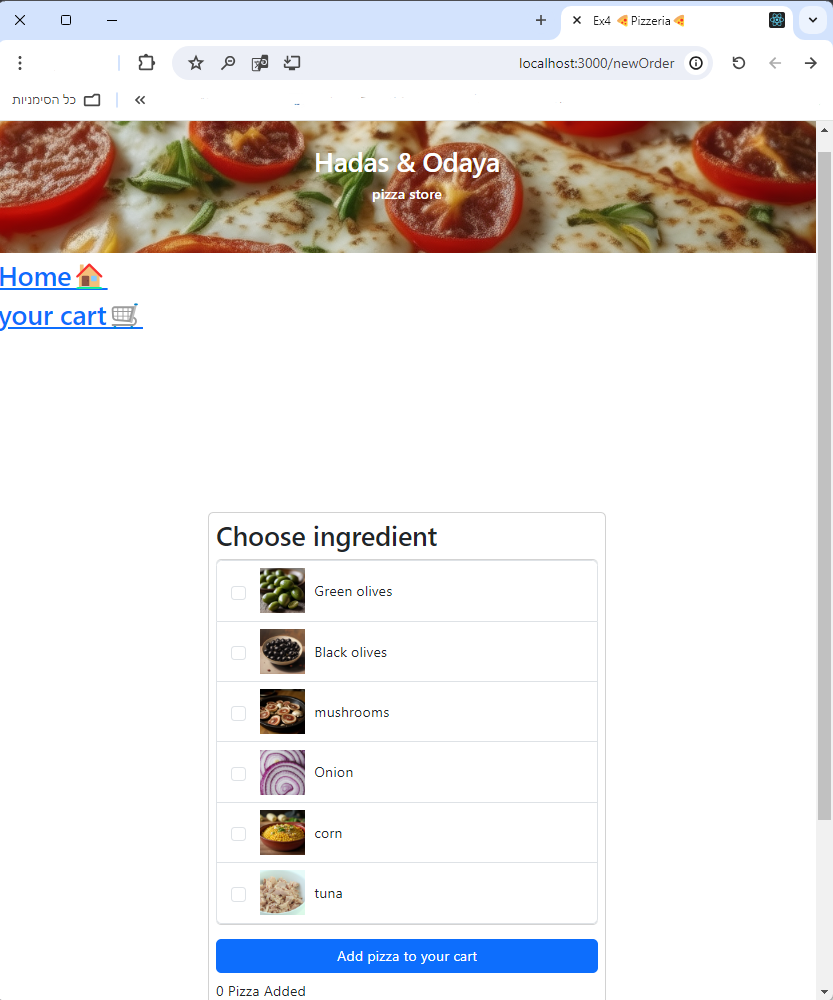
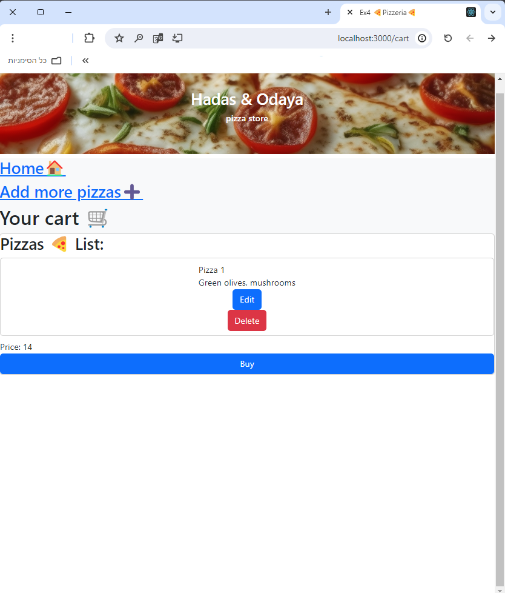
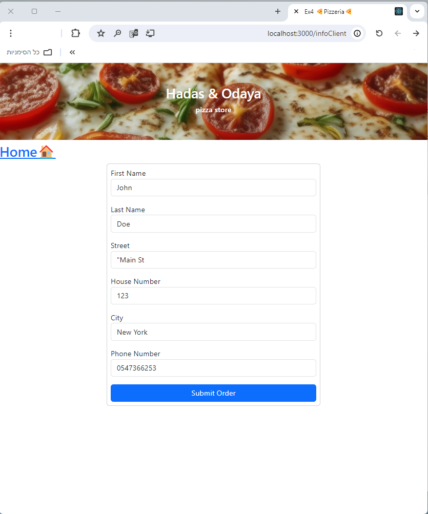
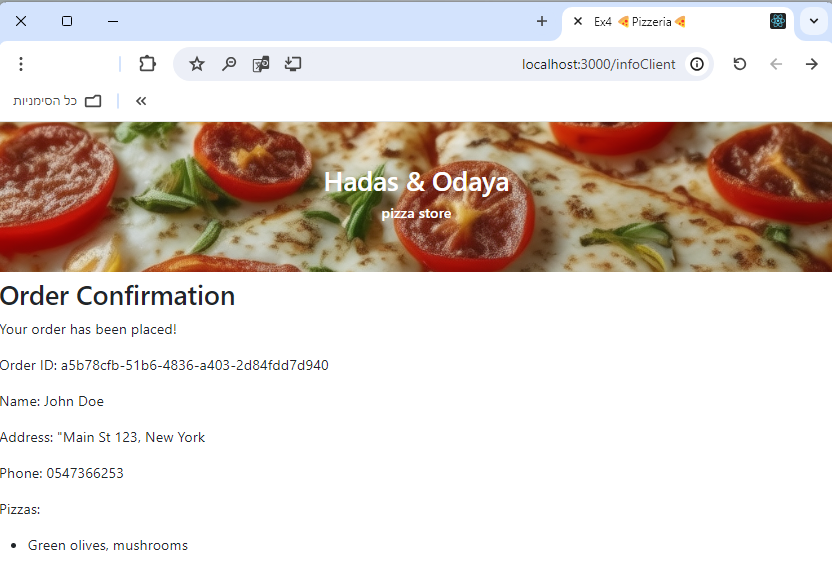
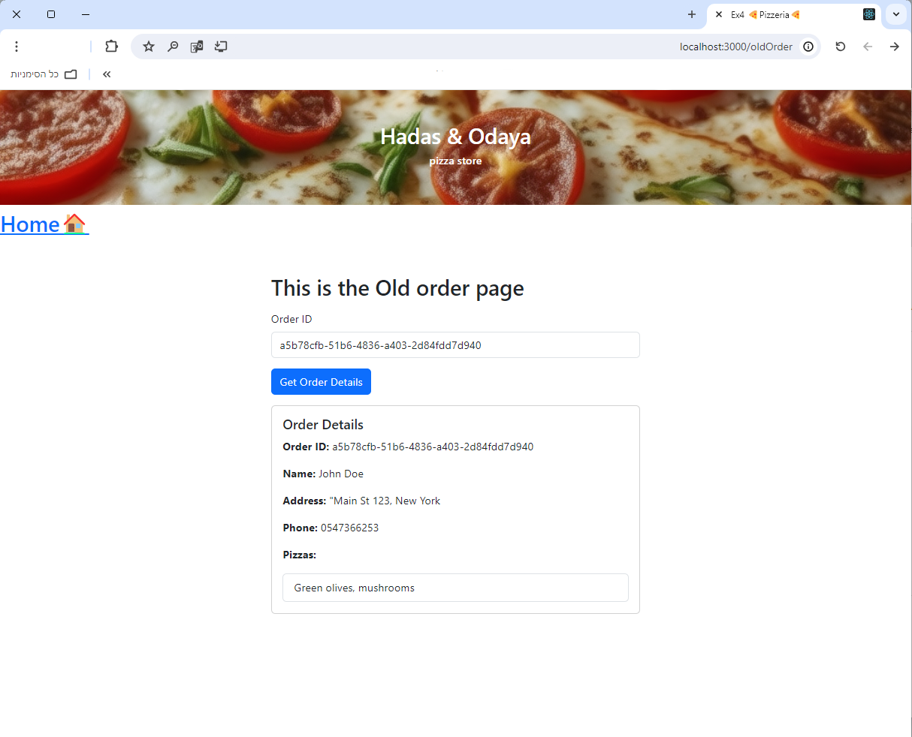

<h1>Pizza Online Store</h1>
This is a web application for an online pizza store built using React for the frontend and Spring Boot for the backend. The application allows users to create new pizza orders, view their cart, fill out client information, and review old orders.

#### Features
- **New Order**: Users can select ingredients and add pizzas to their cart.
- **Cart**: Users can view, edit, and delete pizzas in their cart. The total price of the pizzas is automatically calculated.
- **Client Information**: Users fill out their personal details before submitting an order.
- **Order Confirmation**: After submitting an order, users receive a confirmation with an Order ID, which includes both letters and numbers, for example: `Order ID: a59f1ad5-1b2c-4ee7-bcdc-00f8b3ca881e`.
- **Old Order**: Users can retrieve their previous orders by entering the Order ID.

#### Technologies Used
- **Frontend**: React, React Router, Bootstrap, js-cookie
- **Backend**: Spring Boot

#### Installation

1. **Backend Setup**:
    - Open the backend project in your IDE (e.g., IntelliJ, Eclipse).
    - Run the Spring Boot application.
    - Make sure the backend is running on `http://localhost:8080`.

2. **Frontend Setup**:
    - Navigate to the `client` directory:
      ```bash
      cd client
      ```
    - Install the dependencies:
      ```bash
      npm install
      ```
    - Install the js-cookie library:
      ```bash
      npm install js-cookie
      ```
    - Start the frontend development server:
      ```bash
      npm start
      ```
    - The frontend should now be running on `http://localhost:3000`.

#### Usage
1. **New Order**:
    - Navigate to `http://localhost:3000/newOrder`.
    - Select at least two ingredients for a pizza and click "Add pizza to your cart".
    - You can add multiple pizzas to your cart.


2. **Cart**:
    - Navigate to `http://localhost:3000/cart` to view the pizzas in your cart.
    - Edit or delete pizzas as needed.
    - Click "Buy" to proceed to the client information form.


3. **Client Information**:
    - Fill out the form with your personal details.

    - Click "Submit Order" to complete the order.
    - You will receive an order confirmation with an Order ID.


4. **Old Order**:
    - Navigate to `http://localhost:3000/oldOrder`.
    - Enter your Order ID to retrieve your previous order details.


#### Notes
- **Using js-cookie**: We used the `js-cookie` library to store user details in cookies, allowing the form to be pre-filled with the user's information on subsequent visits.
- **Cart Implementation**: The cart is managed locally within the React application. Therefore, refreshing the page will clear the cart.
- **Order ID**: The Order ID is a unique identifier generated by the backend and contains both letters and numbers.

#### Known Issues
- Refreshing the page will clear the cart since it is managed locally in React.

Feel free to explore and modify the project as needed. If you encounter any issues or have questions, please create an issue on the GitHub repository.

Enjoy your pizza! 🍕
